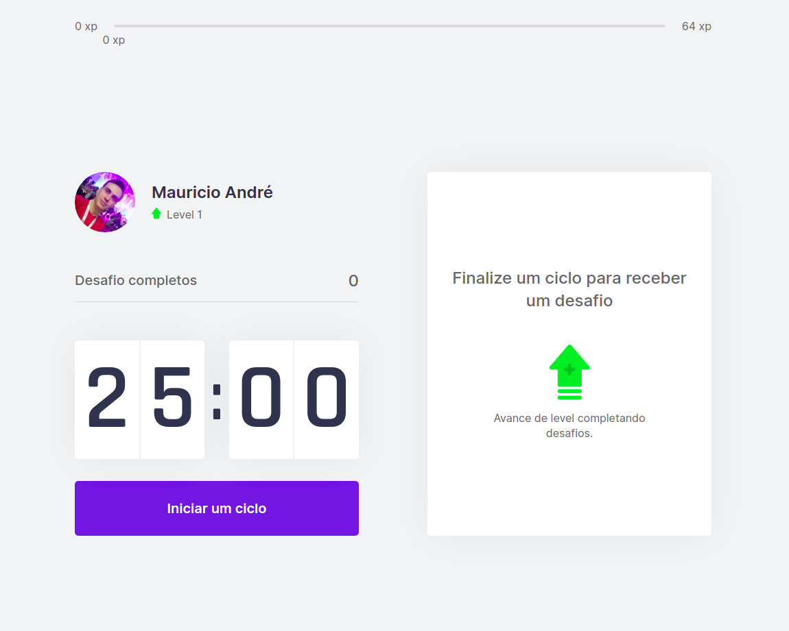

<h1 align="center">
  
</h1>

<h2 align="center">
  MoveIt o pomodoro com o tempero certo!
</h2>

  <a href="#sobre-o-projeto">Sobre o projeto</a>&nbsp;&nbsp;&nbsp;|&nbsp;&nbsp;&nbsp;
  <a href="#get-started">Get Started</a>&nbsp;&nbsp;&nbsp;|&nbsp;&nbsp;&nbsp;
  <a href="#licença">Licença</a>

---

## Sobre o projeto

Este projeto foi desenvolvido durante o quarto evento Next Level Week (NLW) promovido pela rocketseat. O evento NLW é conduzido durante o período de uma semana por um dos educators da rocketseat que guia o aprendizado durante esse período, a quarta edição deste evento trouxe uma trilha de ReactJS com conceitos nunca abordados em edições anteriores.

O projeto desenvolvido durante o evento consiste em um contador decrescente, muito semelhante a contadores pomodoro, que ao chegar a zero sugere uma atividade para alongar o corpo ou exercitar a visão. É fato que muitas pessoas passam horas a fio na frente do computador trabalhando e estudando, esta prática no entanto, pode trazer problemas de saúde como tendinites e problemas de visão. Para evitar estas condições é indicado realizar intervalos e alongamentos entre sessões de trabalho.

Sempre que um desafio é proposto, o usuário tem a opção de confirmar a realização do desafio ou assinalar como não realizado. Cumprir os desafios propostos pelo sistema rende ao usuário pontos de experiência que acumulam para a progressão do nível do usuário.

A construção do aplicativo MoveIt foi realizada com typescript, os dados de avanço do usuário são armazenados em cookies, e o compartilhamento destes dados os componentes do sistema é feito com o context API do ReactJS. Após sua conclusão este aplicativo foi publicado na vercel no endereço temporário [purpletomato.vercel.app](https://purpletomato.vercel.app/)

Nota: esse projeto está em evolução para a inclusão de novas funcionalidades, quando essas estiverem prontas este documento será atualizado.

## Get Started

Para executar essa aplicação é necessário possuir as seguintes dependências em seu ambiente
- nodeJs ^14.15.5

Siga os passos abaixo para executar este projeto em seu computador
- Faça o clone deste repositório para seu ambiente
- Acesse o diretório do repositório por meio do terminal
- Execute o comando `yarn dev` ou `npm run dev` para iniciar o projeto

## Licença
Esse projeto está sob licença MIT, veja o arquivo de [LICENSE](./LICENSE) para mais detalhes
